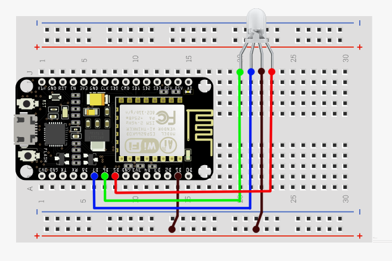

# ESP8266 LAN LightBulb

### Hardware Requirements

1. _ESP8266 NodeMCU_ board.
1. **Common annode** RGB LED.
1. Jumpers or copper wires.

### Schematics

## Prerequisites

1.  Development Tools:

    - [esptool.py](https://github.com/espressif/esptool#esptoolpy)
    - [NodeMCU-Tool](https://github.com/AndiDittrich/NodeMCU-Tool#nodemcu-tool).
    - Linux `screen` command installed for serial communication.

    If you have issues with any of the above mentioned tools, you can refer to these alternatives:

    - For serial communication, you use either [picocom](https://github.com/npat-efault/picocom#picocom) or [minicom](https://github.com/Distrotech/minicom).
    - To embed the app you can use [ESPlorer](https://github.com/4refr0nt/ESPlorer).

1.  Create at NodeMCU firmware at [NodeMCU Build](https://nodemcu-build.com/):

    - Specify an email where you'll get the firmware binaries.
    - It must point to the `release` branch of the [NodeMCU](https://github.com/nodemcu/nodemcu-firmware/) repository.
    - Whitelist the following modules: `file`, `HTTP`, `net`, `node`, `pwm2`, `sjson`, `timer`, and `wifi`.
    - Wait until you get the binaries via email and once you receive them, download the one that ends with `float.bin` into the `app/` directory.

1.  Flash the firmware and test it.

    - Set permissions over the `/dev/ttyUSB0` port and register your linux user into the `dialog` group. This will allow you to use the `nodemcu-tool` properly _(if it fails, reboot your computer to refresh the system changes)_:

          sudo chmod -R 777 /dev/ttyUSB0
          sudo usermod -a -G dialout <user>

          # if you whish to remove the user from 'dialout' group
          sudo gpasswd -d <user> dialout

    - Erase flash:

          esptool.py --port /dev/ttyUSB0 erase_flash

    - Flash NodeMCU firmware:

          esptool.py --port /dev/ttyUSB0 \
          write_flash 0x00000 \
          app/nodemcu-release-9-modules-XXXX-XX-XX-XX-XX-XX-float.bin

    - Open the _NodeMCU shell_:

          sudo screen /dev/ttyUSB0 115200

    - Reboot your _ESP8266_ and you should see a similar output as the following:

          ��l����n�|r��N|�l�$`c����|{��$�n��N�l`��r�l�l�l ��s�p��$�$ ��r�d���$l
          NodeMCU 3.0.0.0 built on nodemcu-build.com provided by frightanic.com
                branch: release
                commit: d4ae3c364bd8ae3ded8b77d35745b7f07879f5f9
                release:
                release DTS: 202105102018
                SSL: false
                build type: float
                LFS: 0x0 bytes total capacity
                modules: file,http,net,node,pwm2,tmr,wifi
          build 2021-05-26 18:11 powered by Lua 5.1.4 on SDK 3.0.1-dev(fce080e)
          >

1.  To upload the app into the device, exit the `screen` session _(`Ctrl + A, K, Y`)_ and then run the following command:

        nodemcu-tool upload app/src/*

1.  Open the _NodeMCU shell_ to monitor logs:

        sudo screen /dev/ttyUSB 115200

### Authentication

To **avoid hardcoded Wi-Fi credentials**, you'll need to connect to your _ESP8266's
Access Point_ following these steps:

1. Go to your phone's _Network Settings_ and locate the **LightBulb-ESP8266** network.
2. One you're connected successfully, open your phone's browser and go to
   `192.168.4.1` to
   set up the credentials of your device's network _(refer to [./src/config.lua](./src/config.lua))_.
3. At the `screen` session, you should see some logs as soon as your device gets
   authenticated at the access point.
4. Switch back to your main network, to stay **synced with your Hub** and proceed to
   [install your driver](../driver/README.md).

### Built-In Controller

To test if your device has been connected properly, you can access the device's
built-in controller at `192.168.X.XX/control`. Notice that the IP will depend on
your phone's current network, _i.e._ if you're connected to the _LightBulb-ESP8266_
network, the _controller_ will be at `192.168.4.1/control`.

Also, I recommend you to test this feature after the device has been integrated into
the _SmartThings ecosystem_, this way you'll be able to see bidirectional communication.

---
